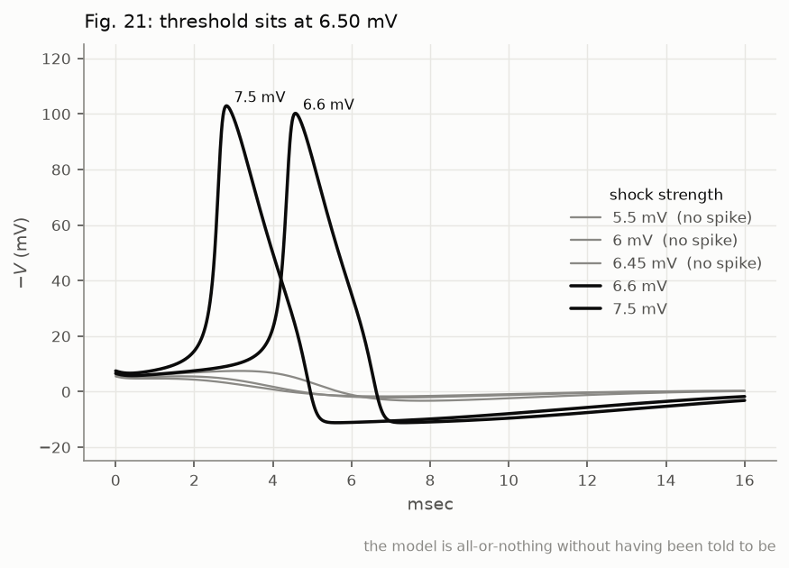
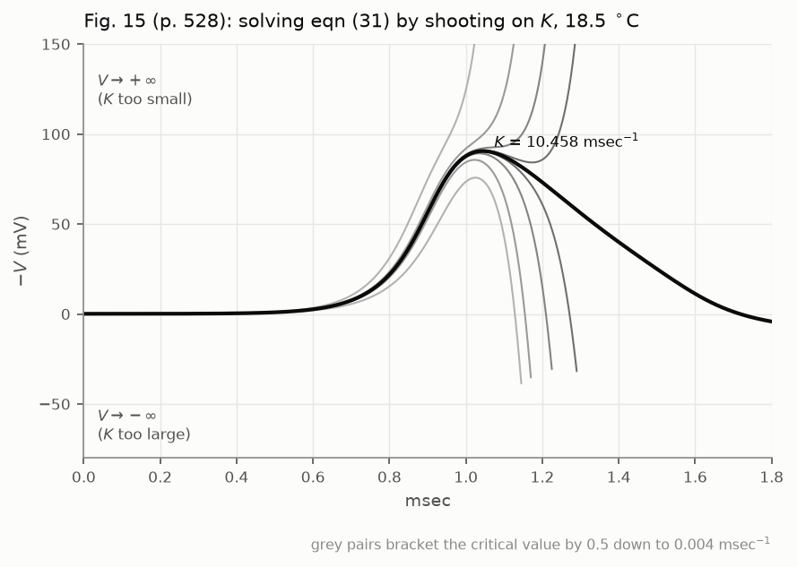
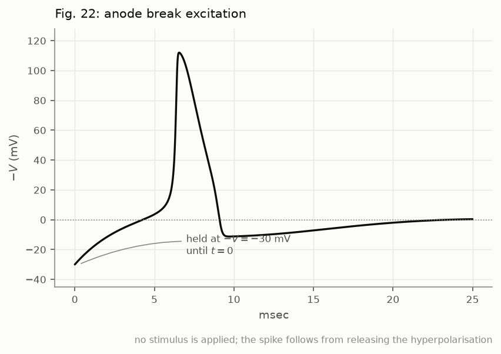

I wrote about the H&H 1952 paper in a previous post and generated some interactive graphs, but really this would be better off as a notebook so I got Claude to rework it. Claude also wrote a rather "click-bait-y" and hyped up blog post, which is quite funny to read. Ths is what Claud thinks, not necessarily what I think:

--

*Hodgkin and Huxley could not have tuned their model to fit, even if they had wanted to. They said so in the paper. Rebuilding the thing from scratch showed me why they were right, and turned up one number they never had.*

[*Last time*](/blog/posts/hodgkin-huxley-deduction/) *I wrote about their 1952 paper as the standard case for mechanistic modelling: six functions fitted to a nerve held at a fixed voltage, which then correctly predicted a nerve doing what nerves actually do. The obvious objection to that story is the one you would make about any model that predicts well. They had the answers. Squid axons had been poked at for fifteen years, everyone knew roughly what an action potential looked like, and if you fiddle with enough parameters you can hit any target you like.*

*So I rebuilt it. Every constant typed in from the printed page, in their own sign convention where depolarisation is negative and* $V_{Na}$ *is −115 mV. No refitting, no modern reparameterisation, nothing borrowed from a textbook version. Then I ran it.*

## *It comes out right*

*The headline number is the conduction velocity. Their equation (31) has a constant* $K$ *in it that depends on how fast the wave travels, which is the thing they were trying to find in the first place. So they guessed. Put in a value, integrate, watch which way the solution blows up, guess again. They landed on* $K$ *= 10.47 msec⁻¹, giving 18.8 m/sec against a measured 21.2.*

*Bisecting on their own criterion instead of guessing gives* $K$ *= 10.458 and a velocity of 18.75 m/sec. That is their number to the printed digit, from their constants, on the first attempt. The whole notebook runs in twelve seconds.*

*Twelve seconds is worth sitting with. The caption to their Figure 12 explains that of three computed action potentials, only one is complete, because for the other two "the calculation was not carried beyond the middle of the falling phase because of the labour involved". They were turning a Brunsviga hand calculator. They stopped early because their arms got tired.*

## *The number they never had*

*That gap buys something. H&H could only say their model's firing threshold lay somewhere between 6 and 7 mV. Bracketing it tighter meant computing more curves, and the curves in that paper cost them the best part of three weeks.*

*Bisection puts it at **6.50 mV** at 6.3 °C, for an instantaneous shock. Below that the membrane sags back to rest. Above it you get a full 105 mV spike. The transition is sharp to four decimal places.*

{fig-alt="Computed membrane action potentials for shocks of 5.5, 6.0, 6.45, 6.6 and 7.5 mV. The three weakest decay back towards rest; the two strongest produce full spikes of about 105 mV."}

*I find this the most pleasing thing in the whole exercise, because it is a genuinely new fact about a model that is seventy-four years old, and it took about a second to produce. Everything else a computer buys you here is the same answers arriving faster. This one is an answer they could not get at all.*

## *Why they couldn't have cheated*

*Now the objection. Here is Hodgkin and Huxley, on page 541, heading it off:*

> *Indeed any such adjustment would be extremely difficult, because in most cases it is impossible to tell in advance what effect a given change in one of the equations will have on the final solution.*

*Reading that, I took it as modesty. Having rebuilt it, I think it is a technical statement about the system, and it is the strongest thing in the paper.*

*The propagated action potential is a shooting problem, and an unstable one. Pick* $K$ *slightly too small and the voltage runs away to* $+\infty$*. Slightly too large and it runs to* $-\infty$*. There is no value that stays bounded for ever: the correct one is a separatrix, and what you converge on is the value whose trajectory hugs the true action potential longest before falling off it. Get* $K$ *wrong in the fourth decimal place and you still diverge, just later.*

{fig-alt="Solutions of equation 31 for values of K either side of the critical value. All follow a common rising curve then diverge, some upwards and some downwards; the closest guess follows the action potential furthest."}

*Now imagine trying to steer that toward a conduction velocity you already know. You would have to work out what nudging one coefficient in one of the six rate functions, say the 0.125 in* $\beta_n$*, does to a solution that is exponentially sensitive to its own initial conditions, on a machine you crank by hand. You cannot do it. The system is too stiff to be led anywhere on purpose.*

*That is what makes the agreement mean something. It is not that they were honest, though they were. It is that the machinery of the model closed off the dishonest route.*

## *Were they right about their own arithmetic?*

*They also claimed their hand computation was accurate enough: they were "confident that the overall errors are not large enough to be detected in the illustrations of this paper". That is checkable now, so I checked it, and the first answer I got made them look bad.*

*At their step size, forward Euler is off by 4 to 8 mV. On a spike of 105 mV that is nearly 8%, which would be visible on any graph.*

*It is the wrong measurement. The rising phase of an action potential is close to vertical, so shifting the upstroke by a hundredth of a millisecond registers as several millivolts of difference in what the voltage is at a given instant. Almost all of that 8% is timing. The error in the height of the spike is between 0.26 and 0.52 mV, or half a percent.*

*Their curves were the right height and the right shape, and may have sat a few microseconds off. Nobody drawing on graph paper in 1952 would have seen it. They were also using Hartree's method rather than Euler, which is better than what I tested them against, so this is an upper bound on their error and not an estimate of it.*

*I nearly published the 8% figure. It took looking at the peak heights separately to see that I had measured the wrong thing, which is a reminder that a number being correct and a number being relevant are different problems.*

## *What I couldn't do*

*I had wanted to make this the paper itself: the original text, the equations in proper LaTeX, the figures rebuilt underneath them. That turns out to be illegal.*

*The 1952 paper is under copyright until 2047 in the US and the end of 2082 here, held by The Physiological Society. PMC hosts the page scans free to read, and is explicit that free to read is not free to redistribute. Wiley's standard academic permission covers three figures or 400 words. The paper is 45 pages, 24 figures and about 16,000 words.*

*So what I built is a reconstruction rather than a reproduction. Equations are facts and appear in full. Short passages are quoted with page numbers. No scanned artwork, and no experimental data: where H&H drew a curve through measured points, only the curve is drawn. If you want the paper verbatim with commentary, Raman and Ferster's The Annotated Hodgkin and Huxley is the licensed edition and it is very good.*

## *The code*

[*github.com/stevehaigh/hodgkin-huxley-1952*](https://github.com/stevehaigh/hodgkin-huxley-1952)*. One notebook that walks the deduction in order, a model file containing nothing but the paper's constants, and 24 tests that pin the published numbers so the thing fails loudly if I break it. MIT licensed.*

*The refractory period, the threshold, and anode break excitation all fall out of equations that were never shown any of them. Anode break is still my favourite: hold the membrane hyperpolarised, then stop, apply nothing at all, and it fires. Inactivation lifts,* $h$ *climbs from 0.60 to 0.99, and the nerve walks back into a resting potential it has sat at a thousand times before with a sodium system that is now fully loaded.*

{fig-alt="A computed action potential following release of a 30 mV hyperpolarisation, with the spike peaking about six milliseconds after release."}

*They did not put that in. It was already there.*

--

------------------------------------------------------------------------

*Hodgkin AL, Huxley AF. 1952. A quantitative description of membrane current and its application to conduction and excitation in nerve. J. Physiol. 117: 500–544. [PMC1392413](https://pmc.ncbi.nlm.nih.gov/articles/PMC1392413/)*

*Raman IM, Ferster DL. 2021. The Annotated Hodgkin and Huxley: A Reader's Guide. Princeton University Press.*