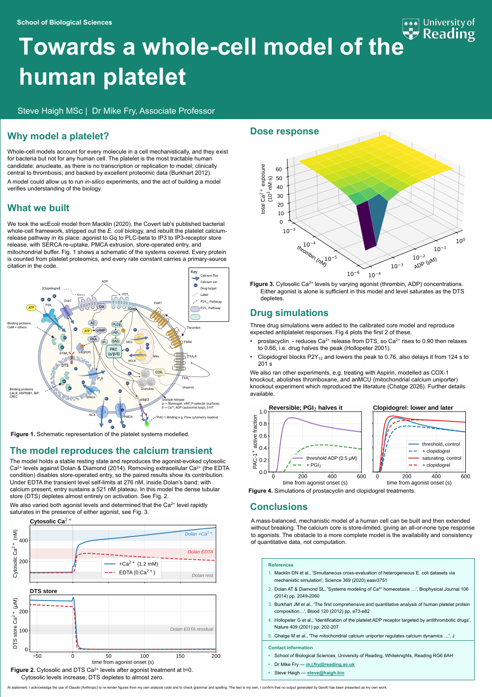
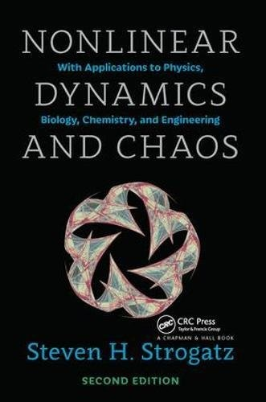

The M.Res. is done.

I don't have the result yet, that's another month or so away, so 🤞. Whatever the mark turns out to be, the year itself has already been worth it. I enjoyed it more than I expected to, and I learned more than I expected to, which is not always the same thing.

## The poster

As I mentioned in [my last update](/blog/posts/the-story-so-far/), my research project was a computer model of the platelet, the small cell in your blood responsible for clotting. It went well enough that when I presented it to my lab group, someone suggested I put a poster in for the UK Platelet Society conference, which was held last week here in Reading.

[{width=70% fig-align="center" fig-alt="The platelet whole-cell model poster."}](platelet-wcm-poster.pdf)

Standing next to a poster is a strange kind of exam. Nobody hands you the syllabus, and the questions arrive in whatever order the room happens to walk past in.

The biologists liked it. Several asked whether they could try the model on their own questions, which is exactly the reaction I wanted, and a good nudge to get on with putting it behind a web page so that using it doesn't require opening a terminal.

The mathematical biologists were a harder audience, and they were right to be. They pointed at parts of the model I hadn't understood were problems. For a while I was taken aback. I thought the work was good, and I still think the work is good. But when I saw what they actually meant, it turned out to be the most useful feedback I've had all year.

Simply put, I had thrown in a lot of reactions, which makes it look more like a platelet, but the model loses a lot of predictive power because there are too many moving parts.

There's a longer post in this, because the gap between the two reactions is interesting and I want to understand properly why a piece of work can land so differently with two groups of people who are, nominally, in the same field. I'll write that up once I've worked through the details. For now the thing worth noting is that the feedback has been enormously helpful in making me specific about what I want to work on next.

## What I want to do next

I always meant the M.Res. to be a stepping stone to a PhD, and that hasn't changed. What's changed is the shape of it. Having built a model and then had it reviewed by people who build models for a living, I want the PhD to sit further towards the mathematics.

In one sense that's just the logical next step from the project. In another it's a different job, and it means relearning a lot of maths I last used properly in the 1990s, plus a fair amount I never did.

I taught myself enough biology to get onto this course out of online courses and books, so I know the approach works, and I'm running it again. At the moment that means [a lecture course on YouTube](https://www.youtube.com/watch?v=41P4vFP7RWo&list=PLXsDp0z6VWFQlsNP4tamU-QtSAG77u4T9) and the [Strogatz book](https://www.stevenstrogatz.com/books/nonlinear-dynamics-and-chaos-with-applications-to-physics-biology-chemistry-and-engineering) that goes with it. There'll be a post about the rest of the reading list in due course.

[{width=180 fig-align="center" fig-alt="Cover of Steven Strogatz, Nonlinear Dynamics and Chaos, second edition."}](https://www.stevenstrogatz.com/books/nonlinear-dynamics-and-chaos-with-applications-to-physics-biology-chemistry-and-engineering)

A year ago I couldn't have told you what a platelet actually does. Last week I presented a model of one, and sat in on several very interesting talks. Better still, a couple of researchers have offered data measuring exactly the parameters I'm trying to model, so there are potential future collaborations forming!

I just need to get on and find a PhD now, or find funding to carry on with what I've started.