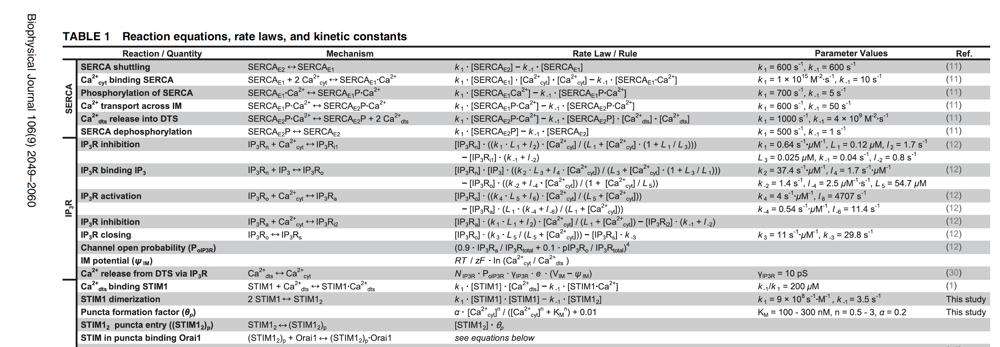
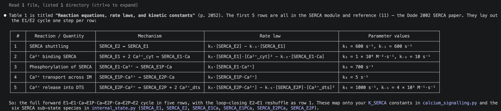
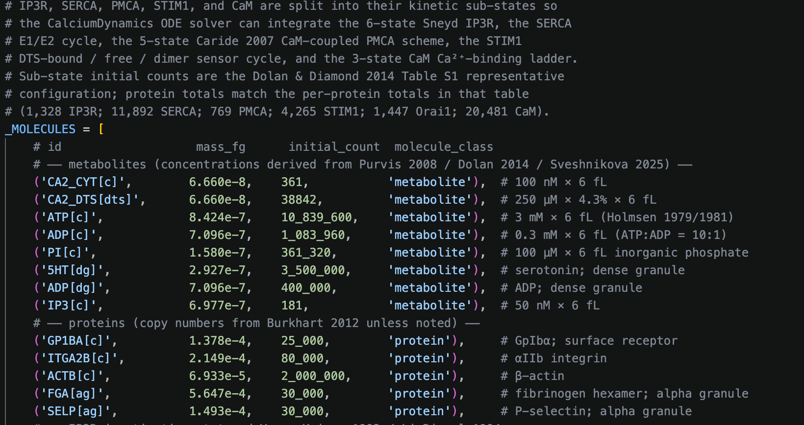
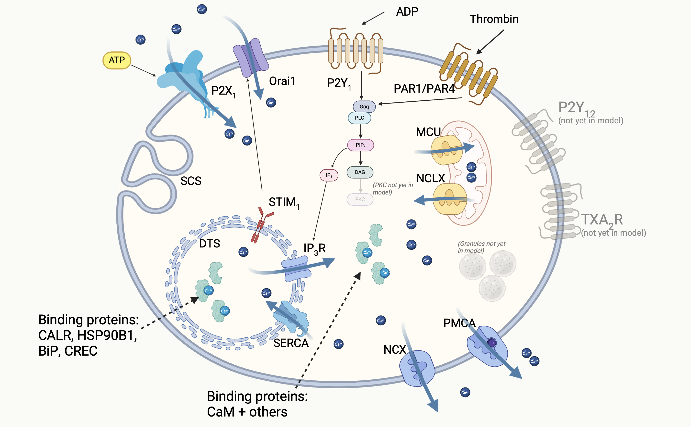
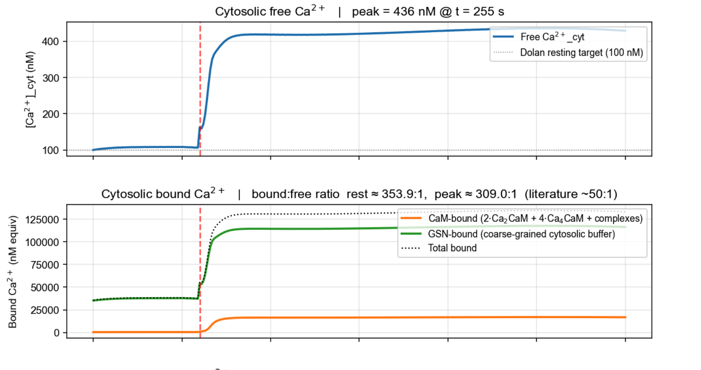
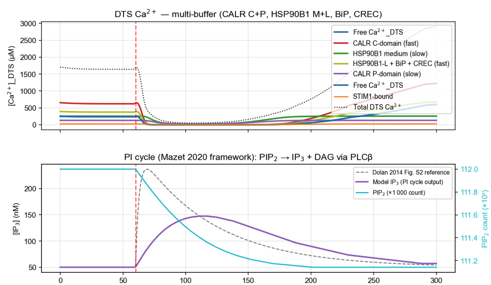

## Quick recap {.tight data-section="Framework choice"}

::: {.columns}
::: {.column width="50%"}
**What I evaluated**

- Aiming to build a computer model of the platelet.
- Has been done before in prokaryotes and yeast but not in other eukaryotic cells.
- Lots of modelling done in platelets but not a whole-cell attempt.
- Lots of options e.g., COPASI, V-Cell and others.
- Landed on wcEcoli project from Covert lab — capable of scaling to whole cell, code quality excellent, something I could work with and expand.
:::

::: {.column width="50%"}
**What I did**

- Forked wcEcoli (i.e., took my own working copy).
- Pruned all *E. coli* biology.
- Used AI to build tests to verify I didn't remove too much.
- Rebuilt cell contents and processes from the platelet literature.
- Kept the simulation engine, state partitioning, listener / analysis framework.
- ~5,000 lines of working code I didn't have to write.
- Emailed Prof. Covert — "sounds fun, good luck".
:::
:::

::: {.notes}
Why not COPASI or V-Cell? — great single-pathway ODE tools, but no copy-number accounting across compartments.

Cheat sheet:

- **COPASI** — open-source biochemical pathway simulator; great for single-pathway ODE work.
- **V-Cell** — UConn cell modelling platform; spatial PDE-capable, domain-specific.
- **SBML** — Systems Biology Markup Language; XML interchange format.
- **BioModels** — EBI repository of curated SBML models.
- **wcEcoli** — Covert Lab's whole-cell *E. coli* model (Karr 2012 lineage; Macklin / Sun *Science* 2020).
:::

## Method to build a calibrated model {data-section="Methodology"}

For each mechanism, a five-step process:

1. **Anchor paper.** E.g., Dolan & Diamond 2014 supplied the validation experiment (Fig. 4 Ca²⁺ transients ± extracellular Ca²⁺) and resting-state targets (100 nM cyt, 250 µM DTS).
2. **Literature review for kinetics.** Primary sources: deYoung–Keizer 1992 for IP₃R, Caride 2007 for PMCA, Hoover & Lewis 2011 for SOCE, Mazet 2020 for the PI cycle…
3. **Species enumeration.** Every Ca²⁺-binding or -gating protein state, with a compartment tag (DTS, Cyt etc.). ~50 species for the calcium pathway.
4. **Copy numbers** from Burkhart 2012 platelet proteomics.
5. **Rate constants.** Primary-source values, units normalised, every value carrying a citation comment in code.

Then: does the resting state hold? Do the timescales line up? Do the unit tests still pass?

::: {.notes}
Every numerical value carries a primary-source citation comment in the code. This is the discipline that catches transcription errors (segues into slide 8).

Step 5 is the key one. There are ~85 rate constants in this model; each is a small research project.

- **Calibrated model** — a model whose parameters are constrained by measurements rather than fitted to the validation experiment.
- **Anchor paper** — the single paper whose experiment you'll validate against; defines targets upfront.
- **IP₃R** — inositol-1,4,5-trisphosphate receptor; Ca²⁺ release channel on the DTS.
- **SERCA** — sarco/endoplasmic-reticulum Ca²⁺ ATPase; pumps Ca²⁺ back into the DTS.
- **PMCA** — plasma-membrane Ca²⁺ ATPase; pumps Ca²⁺ out of the cell.
- **SOCE** — store-operated Ca²⁺ entry; STIM1 / Orai1 mechanism that refills depleted stores from extracellular Ca²⁺.
- **DTS** — dense tubular system; platelet equivalent of ER, the intracellular Ca²⁺ store.
- **Burkhart 2012** — platelet proteomics dataset; absolute copy numbers for ~3,800 platelet proteins.
:::

## Build code from source data — start with the data {data-section="Methodology"}

Start with the published data (usually PDF, sometimes CSV).

{fig-align="center" width="70%"}

## Build code from source data — AI extraction {data-section="Methodology"}

::: {.columns}
::: {.column width="55%"}
Ask AI to extract — get it to tell you what it's doing to sanity check (but it is *very* good at this).

> E.g. I asked: "Please read Dolan and Diamond 2014 and tell me what the first 5 lines of table 1 show."

Simply not feasible to do this by hand at large scale; AI could process 100s of papers in a day. The only challenge is verification, but this is also amenable to AI assistance.
:::

::: {.column width="45%"}
{fig-align="center"}
:::
:::

::: {.notes}
Division of labour: AI does the rote PDF extraction; humans do the sanity check.

- Headline claim: 100s of papers a day is reachable; the bottleneck is verification — and verification is also AI-amenable (see slide 8).
- Authorship of the model — primary source / *wcEcoli* / me, in that order.
- **PDF extraction** — historically painful for tables and footnotes; modern multimodal LLMs are now reliable on well-formatted tables, less so on figures.
- **Sanity check** — the human step: does the extracted value match the paper's text? Do the units make sense?
:::

## Build code from source data — AI writes the code {data-section="Methodology"}

::: {.columns}
::: {.column width="55%"}
Then get AI to build the code, using the *wcEcoli* code as a template.

The code works well, the architecture is not perfect — needs some work to make it more usable for future expansion — but it's an excellent start.
:::

::: {.column width="45%"}
{fig-align="center"}
:::
:::

::: {.notes}
"Building the code" means: scaffolding new process modules off the *wcEcoli* template, wiring rate constants into the existing solver, writing unit tests for invariants.

Works well, not perfect — will need refactoring before v.next.

"Did the AI write code that worked first try?" → no, the back-and-forth is iterative; the AI is a fast scaffolder and a useful pair-programmer, not an oracle.
:::

## What did I build? (so far) {data-section="Result"}

{fig-align="center" width="80%"}

::: {.notes}
- **Agonist** — a signal molecule that activates a platelet (thrombin, ADP, TXA2).
- **GPCR** — G-protein-coupled receptor (PAR1 / PAR4 for thrombin; P2Y1 and P2Y12 for ADP).
- **Gαq** — α-subunit of the heterotrimeric G-protein that activates PLCβ. Gᵢ (P2Y12) is the inhibitory counterpart.
- **PLCβ** — phospholipase Cβ; cleaves PIP₂ → IP₃ + DAG.
- **IP₃** — inositol-1,4,5-trisphosphate; the second messenger that gates IP₃R.
- **NCX / NCLX / MCU** — Na⁺/Ca²⁺ exchanger (PM); Na⁺/Ca²⁺/Li⁺ exchanger (mitochondrial); mitochondrial Ca²⁺ uniporter.
- **CaM** — calmodulin; cytosolic Ca²⁺ sensor / buffer; activates PMCA at high Ca²⁺.
- **CALR / BiP / HSP90B1 / CREC** — major intra-DTS Ca²⁺-binding buffers.
- **STIM1 / Orai1** — DTS Ca²⁺ sensor + PM channel; the SOCE machinery.
- **P2X1** — ATP-gated PM Ca²⁺ channel; ionotropic, not GPCR.
- **SCS / OCS** — surface-connected (open canalicular) system; the platelet's invaginated extracellular surface.
- **TXA2R** — thromboxane A2 receptor; not yet in model.
- **PKC** — protein kinase C; not yet in model.
:::

## Spotting errors in the source {data-section="An aside"}

*The Purvis 2008 k₃ story.*

- Asked AI to check values it had extracted.
- AI spotted that a value quoted in Purvis & Diamond 2008 (a well-known platelet modelling paper) was wrong — units were wrong and value was 100× too large.
- AI found the original study via the references and I verified for myself; AI was correct, there was a typo.
- Very strong use-case for AI — tracking values and assertions across papers. Also very useful for helping to review data: I got the AI to print values it had found, with reference to the primary source and the code, so I could easily review.

::: {.notes}
**Resting-state targets** — cytosolic Ca²⁺ in 90–110 nM; DTS Ca²⁺ in literature range (100–400 µM); IP₃ ≈ 50 nM.

**IP₃-stimulated transient** — the calcium spike following IP₃ release from the GPCR cascade.

**Gαq-active** — fraction of Gαq protein in its GTP-bound, active conformation; an upstream proxy for receptor occupancy.

**Unit test** — automated invariant check (e.g. mass balance, positivity, sub-state sum).
:::

## Validation {data-section="Results"}

::: {.columns}
::: {.column width="50%"}
**Criteria**

Compared output to existing models. Success criteria:

- Resting cytosolic Ca²⁺ within 100 ± 10 nM band
- Resting DTS Ca²⁺ in the literature range
- IP₃-stimulated transient peak height in band
- Transient duration matches shape of previous model(s)
:::

::: {.column width="50%"}
**Model state at 14 May**

- Resting cyt Ca²⁺: 104 nM ✓
- Resting DTS Ca²⁺: 235 µM ✓
- Resting IP₃: 50 nM ✓
- Resting Gαq-active: 100 of 5000 ✓
- 21 / 21 unit tests pass
- Driven by physiological agonists — 1 nM thrombin, 10 µM ADP. No hand-fitted IP₃ forcing.
:::
:::

## Model stimulated with ADP / thrombin — cytosolic Ca²⁺ {data-section="Results"}

{fig-align="center" width="75%"}

## Model stimulated with ADP / thrombin — DTS Ca²⁺ {data-section="Results"}

{fig-align="center" width="75%"}

## Where it goes from here {.tight data-section="Outlook"}

**Near-term biology**

- Granule release — the model currently stops at the Ca²⁺ peak.
- Implement P2Y₁₂, TXA2R receptors and more, depending on time.
- Run experiments e.g. when P2Y₁₂ / Gᵢ are wired up, add clopidogrel as an *in silico* drug experiment.

**Wider impact**

- Platelet–CTC interactions. A calibrated platelet model could in principle be coupled to a tumour-cell model.
- Methodology generalises to other single-cell calibration problems — if pathways are well-quantified, no reason not to try modelling them in a cancer cell.
- Multiple cell–cell interactions — thrombus formation?

**Blue sky goal**

- I'd like to get to a point where a biologist with limited coding experience could build a model with AI help. Very long shot: a system where a user drops primary data and text instructions into an app and the model builds itself.
