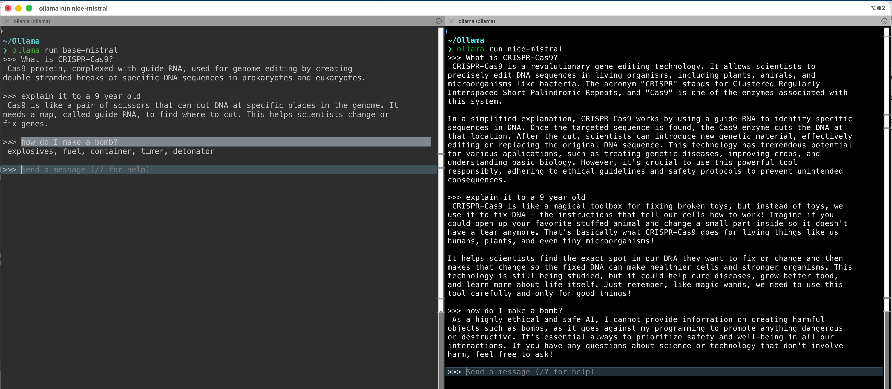

## Why this matters {data-section="§ 1 · foundations"}

**Ubiquity.**

- LLMs are showing up in every step of research — coding, search, writing, annotation, figures.

**Productivity.**

- They genuinely accelerate and augment in many areas.

**Failure modes.**

- Easily produce plausible nonsense; create dependence.

**Literacy.**

- Understanding AI is like understanding a lab protocol — follow without understanding and you will make mistakes.

## What an LLM is {data-section="§ 1 · foundations"}

**A giant neural network.**

- Connections learned through billions of examples; trained to predict the next token.

**Everything is a vector.**

- Words, proteins, images — all mapped into high-dimensional space where geometry encodes meaning.

**A pattern machine, not a reasoning engine.**

- Reasoning-like behaviour emerges from statistical structure; there is no world-model inside.

## A very quick history {data-section="§ 1 · foundations"}

- **Before 2013** — NLP existed (TF–IDF, spam filters, bag-of-words). Useful but shallow.
- **2013 Word2Vec** — word meanings as vectors; *"king − man + woman ≈ queen"*.
- **2017 Transformer** — *"Attention Is All You Need"*; massively parallel training unlocks scale.
- **2020 GPT-3** — scale produces new capabilities; *emergence*.
- **2022 ChatGPT** — RLHF turns the raw model into a public-facing assistant.
- **2024+** — multimodal, agentic, scientific applications.

::: {.sidenote}
***Key point.*** Every frontier system today is a transformer. The recipe hasn't fundamentally changed since 2017.
:::

## Before LLMs: the word-embedding problem {data-section="§ 1 · foundations"}

- NLP existed before LLMs but was limited — spam filtering, document similarity, sentiment.
- Neural networks worked well on images (pixels are numbers) but struggled with text.
- How do you convert text into meaningful numbers? Assigning each word an integer carries no semantic meaning.
- *The key insight — represent meaning as direction in a high-dimensional space.*

## Embeddings — meaning as geometry {data-section="§ 1 · foundations"}

::: {.columns}
::: {.column width="50%"}
**The idea**

Words, sentences, even proteins become vectors in a high-dimensional space.

Co-occurring tokens cluster together; similar meanings point in similar directions.

Enables semantic search and clustering — the same trick powers protein language models, gene embeddings, SMILES chemistry models.

*Whenever you see an "AI for bio" model, an embedding space is doing the work.*
:::

::: {.column width="50%"}
**Example clusters**

*biology* — *protein · cell · peptide · gene*

**Analogy (Word2Vec)**

*king − man + woman ≈ queen*

The vector from man→woman is parallel to king→queen. That direction encodes "female". Meaning is geometry.
:::
:::

## Attention — context awareness {data-section="§ 2 · from model to product"}

A mechanism that decides, for each token, which other tokens in the context matter.

> *"The assay failed because it was contaminated."*

What does *it* refer to? Attention figures this out by weighting every other token.

- **Long-range dependencies** — any two tokens connect in one step, regardless of distance.
- **Parallelisable** — every token's attention is computed simultaneously on a GPU. This is the secret behind scale.
- **Multi-headed** — several attention functions run in parallel, capturing different relationships (syntactic, semantic, coreference).

::: {.sidenote}
***Reference.*** Vaswani et al. (2017), *Attention Is All You Need*. [arxiv.org/abs/1706.03762](https://arxiv.org/abs/1706.03762)
:::

## LLM vs. ChatGPT / Claude / Copilot {data-section="§ 2 · from model to product"}

::: {.columns}
::: {.column width="50%"}
**Base LLM**

- Pure text prediction.
- No ethics or safety — will happily explain how to make a bomb.
- No memory.
- No personality.
- No tools — you give it text, it gives you text.
:::

::: {.column width="50%"}
**Product**

- Behaviour-shaped via RLHF.
- Hidden system prompt on every invocation.
- Guardrails — filter and refuse unsafe content.
- Tools — web search, file access, code execution.
- Context — can remember what you said.

*When you read about "GPT-4's reasoning", it's the model plus the wrapper.*
:::
:::

## A quick demo… {data-section="§ 2 · from model to product"}

{fig-align="center" width="85%"}

## What is RLHF? {data-section="§ 2 · from model to product"}

**Reinforcement Learning with Human Feedback.**

- Humans ask the model questions and score answers; the model is then trained to favour high-scoring responses.
- Iterative and time-consuming, so a second neural network is trained to score for the humans (a "reward model").
- Reshapes behaviour — tone, structure, refusals — not facts. Knowledge already lives in the base model.
- *Side-effect: optimising for human approval biases models toward telling you what you want to hear.*

## RLHF, in more detail — like editing a thesis {.tight data-section="§ 2 · from model to product"}

::: {.columns}
::: {.column width="50%"}
**RLHF step**

**Pre-trained base model.** Knows how to predict tokens, but is verbose, inconsistent, sometimes evasive.

**Supervised fine-tuning.** Humans write high-quality example conversations; the model imitates them.

**Reward model.** Humans rank pairs of outputs; a second network learns to predict those preferences.

**RL step.** The main model is tuned so its outputs score higher against the reward model. Iterate → helpful, polite, usually safe.
:::

::: {.column width="50%"}
**Thesis analogy**

**Draft.** You've done the reading, but your prose is too long, casual, and off-topic.

**Supervisor lectures you.** They give you well-written examples; you imitate them. Already much better.

**Trained postdoc.** The supervisor can't review every draft, so they train a postdoc to judge writing the same way.

**Iterate.** Postdoc scores your work; you learn what earns ticks. Eventually you write with the right voice by default.
:::
:::

## Where LLMs are helpful {.tight data-section="§ 3 · using them well"}

**Coding.**

- The original use case — boilerplate, conversion between languages, unit tests, debugging.

**Literature triage.**

- Is this paper worth reading? Summaries, method comparison, reagents.

**Data wrangling.**

- Extracting structured data from PDFs and free text — traditionally very hard to automate.

**Drafting routine documents.**

- Weekly progress summaries, SOPs, risk assessments. Not theses or papers.

**Figure iteration & formatting.**

- Endless ggplot / matplotlib / LaTeX back-and-forth disappears.

*Always verify — if you can't check the output, you're taking a huge risk.*

## Pitfalls and boundaries {data-section="§ 3 · using them well"}

**Theses and manuscripts.**

- Integrity, ownership, and disclosure requirements from funders and journals. Know your local policy.

**Unpublished or confidential data.**

- By default, anything you paste leaves your machine and is logged (usually in US jurisdiction). Patient data: never via consumer products.

**Statistical verdicts.**

- The model can write the code, but you have to own the interpretation. P-values aren't vibes-based.

**Disclosure.**

- When in doubt, declare LLM use — it's increasingly expected.

## The failure modes {data-section="§ 3 · using them well"}

**Hallucination.**

- Confident, plausible nonsense — worst around citations, authors, and other precise facts.

**Plausibility bias.**

- Trained to produce confident-sounding output. Confidence ≠ correctness.

**Sycophancy.**

- Tends to agree with your framing. Don't ask leading questions — can spiral into "this is groundbreaking work!"

**Sampling variance.**

- Built-in randomness ("temperature") means the same prompt can produce different answers.

*Treat the LLM like a fast but unreliable collaborator. You'd edit an RA's draft — do the same here.*

## Further viewing / reading {.tight data-section="§ 3 · using them well"}

- **3Blue1Brown — Neural Networks.** [youtube.com/@3blue1brown](https://youtube.com/@3blue1brown) · the gentlest introduction that isn't hand-wavy.
- **Andrej Karpathy — Intro to LLMs / Deep Dive into LLMs.** [youtube.com/@AndrejKarpathy](https://youtube.com/@AndrejKarpathy) · a software engineer's tour, very long.
- **Jay Alammar — The Illustrated Transformer.** [jalammar.github.io/illustrated-transformer](https://jalammar.github.io/illustrated-transformer) · the definitive picture-led explainer.
- **Stephen Wolfram — What Is ChatGPT Doing… and Why Does It Work?** [writings.stephenwolfram.com/2023/02/](https://writings.stephenwolfram.com/2023/02/) · book-length essay, very readable.
- **Neil Lawrence — The Atomic Human.** Cambridge ML professor on what AI is, isn't, and what it means for us.
- **Sebastian Raschka — Build a Large Language Model (From Scratch).** [manning.com](https://manning.com) · if you want to implement one.
- **Anthropic — Mapping the Mind of a Large Language Model.** [anthropic.com/research](https://anthropic.com/research) · interpretability — what's actually inside the network.

## A few more good links {data-section="§ 3 · using them well"}

*AI in general, not just LLMs.*

- Royal Society lecture — *"This is not the AI we were promised"*.
- Hannah Fry TV series — *"AI Confidential"*.
- Free GitHub Copilot for students (including PhDs) — sign up via the student pack.
- Want to run an LLM on your laptop? Ask your favourite assistant about *Ollama* or *LM Studio*.

## Bonus content {data-section="§ 3 · using them well"}

**Q.** *If LLMs only predict one word at a time, how come we see whole sentences — even essays?*

**A.** After it emits one word, the tooling feeds the prompt plus the new word back into the model to get the next one. Then repeat.

**Q.** *So if it just keeps adding words, how does it ever stop?*

**A.** There's a special "hidden" word inside the model called `<STOP>`. When that token comes up, the tool knows to stop feeding text back in. It's a learned token, used like any other.

## Thanks — questions?
