

A working shortlist of bottles worth buying — Bordeaux, Burgundy and the Rhône in red; Burgundy, the Loire, Alsace and the Jura in white, plus a pair of Provençal rosés. Prices are indicative for single bottles from [The Wine Society](https://www.thewinesociety.com) and drinking windows are a guide, not gospel. Each card links to the merchant page, to [Wine-Searcher](https://www.wine-searcher.com) for critic scores and global pricing, and to [CellarTracker](https://www.cellartracker.com) for community tasting notes.

::: {.cellar-summary}
**24 wines** · 12 red · 12 white & rosé · indicative total **£749.50** · 18 with a bottle photo (click any label to enlarge). Where a wine's exact vintage was unavailable the label shown is the nearest vintage (noted on the card); a few have no photo and appear as a plaque.
:::

## Reds

### Bordeaux — Red

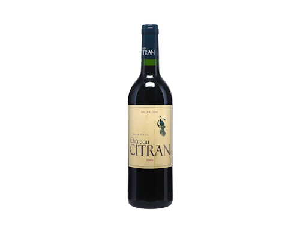

£35
<h3 class="wine-name">Château Citran</h3>

Citran · Haut-Médoc · <strong>2009</strong> · Cabernet/Merlot

Drink now (mature)Drink 2026–2030

2009 was one of the great modern Bordeaux vintages; fully mature at ~16 years and ready now. The drink-now counterweight to younger bottles — mature claret from a legendary year for £35.

<a href="https://www.thewinesociety.com/product/chateau-citran-haut-medoc-2009-en.aspx" target="_blank" rel="noopener">The Wine Society</a><a href="https://www.wine-searcher.com/find/chateau+citran/2009" target="_blank" rel="noopener">Wine-Searcher</a><a href="https://www.cellartracker.com/list.asp?szSearch=chateau+citran+2009" target="_blank" rel="noopener">CellarTracker</a>

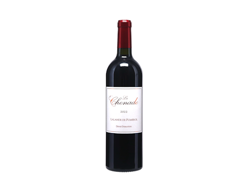

£28
<h3 class="wine-name">Durantou family</h3>

La Chenade · Lalande de Pomerol · <strong>2022</strong> · Merlot

Near-term (right bank)Drink 2026–2032

Right-bank Merlot contrast. From the Durantou family of L&#x27;Église-Clinet, one of Pomerol&#x27;s most revered estates — their humbler Lalande cuvée. Plush, sandy-gravel fruit; give it 2–3 years.

<a href="https://www.thewinesociety.com/product/la-chenade-lalande-de-pomerol-2022/" target="_blank" rel="noopener">The Wine Society</a><a href="https://www.wine-searcher.com/find/durantou+la+chenade/2022" target="_blank" rel="noopener">Wine-Searcher</a><a href="https://www.cellartracker.com/list.asp?szSearch=durantou+la+chenade+2022" target="_blank" rel="noopener">CellarTracker</a>

2016Cabernet/Merlotno photo

£39
<h3 class="wine-name">Château Chasse-Spleen</h3>

Chasse-Spleen · Moulis · <strong>2016</strong> · Cabernet/Merlot

Lay downDrink 2026–2038

The &#x27;chasing away melancholy&#x27; name; leading property of the overlooked Moulis appellation; 2016 a benchmark Left Bank vintage. Ages beautifully. (2019 available at £33 as a cheaper alternative.)

<a href="https://www.thewinesociety.com/product/chateau-chasse-spleen-moulis-2016" target="_blank" rel="noopener">The Wine Society</a><a href="https://www.wine-searcher.com/find/chateau+chasse+spleen/2016" target="_blank" rel="noopener">Wine-Searcher</a><a href="https://www.cellartracker.com/list.asp?szSearch=chateau+chasse+spleen+2016" target="_blank" rel="noopener">CellarTracker</a>

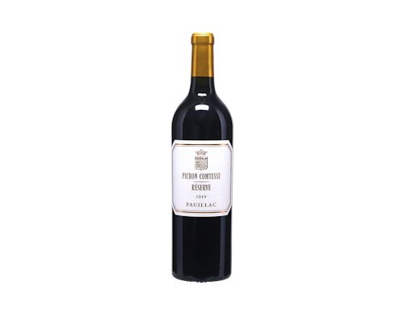

£39
<h3 class="wine-name">Pichon-Lalande</h3>

Réserve de la Comtesse · Pauillac · <strong>2019</strong> · Cabernet/Merlot

Lay down (super-second)Drink 2027–2038

Second wine of Pichon-Lalande, a Médoc &#x27;super-second&#x27;, in the excellent 2019 vintage. Classic cassis-and-cedar Pauillac to cellar — most of the house style at a fraction of the grand vin price.

<a href="https://www.thewinesociety.com/product/reserve-de-la-comtesse-pauillac-2019/" target="_blank" rel="noopener">The Wine Society</a><a href="https://www.wine-searcher.com/find/pichon+lalande+reserve+de+la+comtesse/2019" target="_blank" rel="noopener">Wine-Searcher</a><a href="https://www.cellartracker.com/list.asp?szSearch=pichon+lalande+reserve+de+la+comtesse+2019" target="_blank" rel="noopener">CellarTracker</a>

### Burgundy — Red

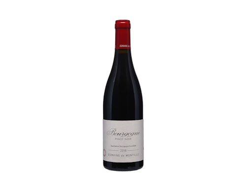
label shown: 2018 vintage

£30
<h3 class="wine-name">Domaine de Montille</h3>

Bourgogne Rouge · Bourgogne · <strong>2021</strong> · Pinot Noir

Drink now (smart value)Drink 2026–2027

Declassified regional Pinot from a great Volnay/Pommard domaine; no new wood, pure and transparent. A slice of a top address for £30. 2021 was light — drink soon.

<a href="https://www.thewinesociety.com/product/domaine-de-montille-bourgogne-rouge-2018/" target="_blank" rel="noopener">The Wine Society</a><a href="https://www.wine-searcher.com/find/domaine+de+montille+bourgogne+rouge/2021" target="_blank" rel="noopener">Wine-Searcher</a><a href="https://www.cellartracker.com/list.asp?szSearch=domaine+de+montille+bourgogne+rouge+2021" target="_blank" rel="noopener">CellarTracker</a>

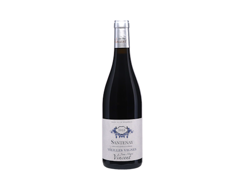

£35
<h3 class="wine-name">Jean-Marc Vincent</h3>

Santenay Rouge Vieilles Vignes · Santenay · <strong>2018</strong> · Pinot Noir

Near-term (top grower)Drink 2026–2028

Buy-the-grower in an overlooked village: Vincent revived Santenay&#x27;s reputation. Old vines, warm ripe 2018; keen money at a case-of-12 price.

<a href="https://www.thewinesociety.com/product/jean-marc-vincent-santenay-rouge-vieilles-vignes-2018/" target="_blank" rel="noopener">The Wine Society</a><a href="https://www.wine-searcher.com/find/jean+marc+vincent+santenay+rouge+vieilles+vignes/2018" target="_blank" rel="noopener">Wine-Searcher</a><a href="https://www.cellartracker.com/list.asp?szSearch=jean+marc+vincent+santenay+rouge+vieilles+vignes+2018" target="_blank" rel="noopener">CellarTracker</a>

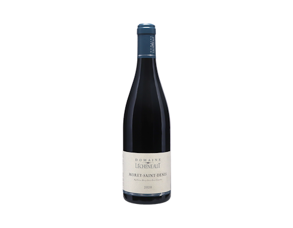

£45
<h3 class="wine-name">Domaine Lécheneaut</h3>

Morey-Saint-Denis · Morey-Saint-Denis · <strong>2020</strong> · Pinot Noir

Lay down (Côte de Nuits)Drink 2026–2034

Structured Côte de Nuits keeper from a top Nuits grower; a serious red commune in the benchmark 2020 vintage. Backbone and ageability the Beaune villages lack — the grandest address here for the money.

<a href="https://www.thewinesociety.com/product/domaine-lecheneaut-morey-st-denis-2020/" target="_blank" rel="noopener">The Wine Society</a><a href="https://www.wine-searcher.com/find/domaine+lecheneaut+morey+saint+denis/2020" target="_blank" rel="noopener">Wine-Searcher</a><a href="https://www.cellartracker.com/list.asp?szSearch=domaine+lecheneaut+morey+saint+denis+2020" target="_blank" rel="noopener">CellarTracker</a>

2020Pinot Noirno photo

£33
<h3 class="wine-name">Chanson Père et Fils</h3>

Savigny-lès-Beaune 1er Cru La Dominode · Savigny-lès-Beaune 1er Cru · <strong>2020</strong> · Pinot Noir

Value 1er cruDrink 2025–2032

One of Savigny&#x27;s finest old-vine sites; Chanson (Bollinger-owned) on strong form; generous 2020 vintage. A genuine premier cru for £33.

<a href="https://www.thewinesociety.com/search?q=Chanson%20Savigny%20Dominode%201er%20Cru%202020" target="_blank" rel="noopener">The Wine Society (search)</a><a href="https://www.wine-searcher.com/find/chanson+pere+et+fils+savigny+les+beaune+1er+cru+la+dominode/2020" target="_blank" rel="noopener">Wine-Searcher</a><a href="https://www.cellartracker.com/list.asp?szSearch=chanson+pere+et+fils+savigny+les+beaune+1er+cru+la+dominode+2020" target="_blank" rel="noopener">CellarTracker</a>

### Rhône — Red

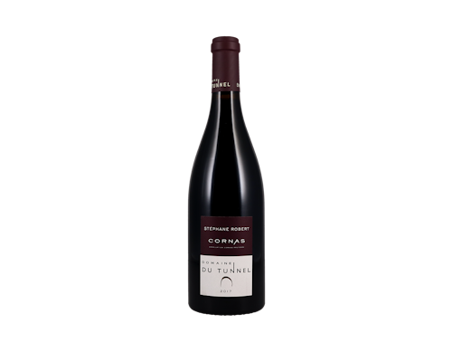
label shown: 2017 vintage

£44
<h3 class="wine-name">Domaine du Tunnel</h3>

Cornas · Cornas · <strong>2019</strong> · Syrah

Lay down (structured Syrah)Drink 2026–2034

Cornas is the dark, structured bargain next to Hermitage; benchmark 2019 vintage; cult grower Stéphane Robert makes it in a disused railway tunnel. Tannic and savoury — one to lay down.

<a href="https://www.thewinesociety.com/product/cornas-domaine-du-tunnel-2017" target="_blank" rel="noopener">The Wine Society</a><a href="https://www.wine-searcher.com/find/domaine+du+tunnel+cornas/2019" target="_blank" rel="noopener">Wine-Searcher</a><a href="https://www.cellartracker.com/list.asp?szSearch=domaine+du+tunnel+cornas+2019" target="_blank" rel="noopener">CellarTracker</a>

2023Syrahno photo

£32
<h3 class="wine-name">Domaine Yann Chave</h3>

Crozes-Hermitage Le Rouvre (organic) · Crozes-Hermitage · <strong>2023</strong> · Syrah

Near-term (northern Syrah)Drink 2025–2030

Earlier-drinking northern Syrah from one of Crozes&#x27;s best growers, now farming organically; generous 2023. Peppery and approachable young — open while the Cornas sleeps.

<a href="https://www.thewinesociety.com/search?q=Yann%20Chave%20Crozes-Hermitage%20Le%20Rouvre%202023" target="_blank" rel="noopener">The Wine Society (search)</a><a href="https://www.wine-searcher.com/find/domaine+yann+chave+crozes+hermitage+le+rouvre/2023" target="_blank" rel="noopener">Wine-Searcher</a><a href="https://www.cellartracker.com/list.asp?szSearch=domaine+yann+chave+crozes+hermitage+le+rouvre+2023" target="_blank" rel="noopener">CellarTracker</a>

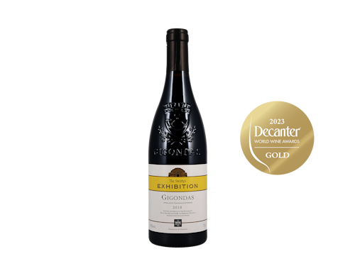
label shown: 2018 vintage

£22
<h3 class="wine-name">The Wine Society (Exhibition)</h3>

Exhibition Gigondas · Gigondas · <strong>2019</strong> · Grenache/Syrah

Value (southern Grenache)Drink 2026–2029

Value steal: most of Châteauneuf&#x27;s warmth for far less, blended by Louis Barruol of Château de Saint Cosme in the excellent 2019 vintage. Top-grower craft at a giveaway price.

<a href="https://www.thewinesociety.com/product/the-societys-exhibition-gigondas-2018/" target="_blank" rel="noopener">The Wine Society</a><a href="https://www.wine-searcher.com/find/the+wine+society+exhibition+gigondas/2019" target="_blank" rel="noopener">Wine-Searcher</a><a href="https://www.cellartracker.com/list.asp?szSearch=the+wine+society+exhibition+gigondas+2019" target="_blank" rel="noopener">CellarTracker</a>

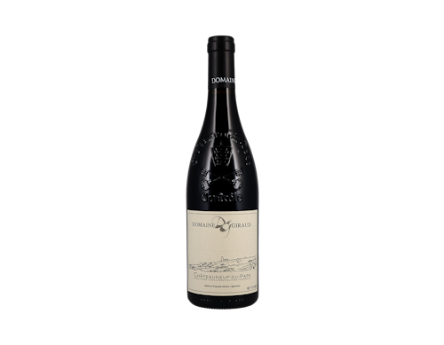
label shown: 2019 vintage

£39
<h3 class="wine-name">Domaine Giraud</h3>

Châteauneuf-du-Pape Tradition · Châteauneuf-du-Pape · <strong>2023</strong> · Grenache blend

Lay down (flagship south)Drink 2026–2035

The flagship southern red done properly — a top family estate in the classic perfumed, Grenache-led style (not the heavy modern idiom). Garrigue-scented; built to age. (Exhibition Châteauneuf 2022 at £28.50 a value alt.)

<a href="https://www.thewinesociety.com/product/chateauneuf-du-pape-tradition-domaine-giraud-2019/" target="_blank" rel="noopener">The Wine Society</a><a href="https://www.wine-searcher.com/find/domaine+giraud+chateauneuf+du+pape+tradition/2023" target="_blank" rel="noopener">Wine-Searcher</a><a href="https://www.cellartracker.com/list.asp?szSearch=domaine+giraud+chateauneuf+du+pape+tradition+2023" target="_blank" rel="noopener">CellarTracker</a>

## Whites &amp; Rosé

### Burgundy — White

2021Chardonnayno photo

£25
<h3 class="wine-name">Jean-Philippe Fichet</h3>

Bourgogne Blanc · Bourgogne · <strong>2021</strong> · Chardonnay

Smart value (declassified)Drink 2026–2027

The white equivalent of the de Montille pick: Fichet is a revered Meursault grower and this barrel-fermented regional white is effectively a baby Meursault — his precision at a quarter of the village price. The linear 2021 suits it.

<a href="https://www.thewinesociety.com/product/jean-philippe-fichet-bourgogne-blanc-vieilles-vignes-2021/" target="_blank" rel="noopener">The Wine Society</a><a href="https://www.wine-searcher.com/find/jean+philippe+fichet+bourgogne+blanc/2021" target="_blank" rel="noopener">Wine-Searcher</a><a href="https://www.cellartracker.com/list.asp?szSearch=jean+philippe+fichet+bourgogne+blanc+2021" target="_blank" rel="noopener">CellarTracker</a>

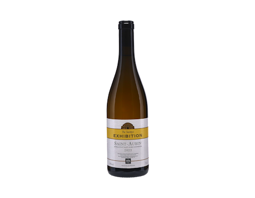

£26
<h3 class="wine-name">The Wine Society (Exhibition)</h3>

Exhibition Saint-Aubin Blanc · Saint-Aubin · <strong>2023</strong> · Chardonnay

Value (Côte de Beaune)Drink 2026–2028

Saint-Aubin is the connoisseur&#x27;s bargain of the Côte de Beaune — baby-Puligny character tucked behind Chassagne and Puligny. The Society&#x27;s own bottling from the ripe, generous 2023 vintage; a low-risk way in.

<a href="https://www.thewinesociety.com/product/the-societys-exhibition-st-aubin-blanc-2023-en.aspx" target="_blank" rel="noopener">The Wine Society</a><a href="https://www.wine-searcher.com/find/the+wine+society+exhibition+saint+aubin+blanc/2023" target="_blank" rel="noopener">Wine-Searcher</a><a href="https://www.cellartracker.com/list.asp?szSearch=the+wine+society+exhibition+saint+aubin+blanc+2023" target="_blank" rel="noopener">CellarTracker</a>

2020Chardonnayno photo

£32
<h3 class="wine-name">Olivier Merlin</h3>

Mâcon La Roche Vineuse Les Cras · Mâcon-La Roche-Vineuse · <strong>2020</strong> · Chardonnay

Value (Mâconnais)Drink 2026–2027

The Mâconnais value statement. Merlin helped drag the region&#x27;s reputation upward; Les Cras is a limestone site (the name means chalk/limestone) and 2020 was an excellent white vintage. Serious southern-Burgundy Chardonnay for £32.

<a href="https://www.thewinesociety.com/search?q=Olivier%20Merlin%20Macon%20La%20Roche-Vineuse%20Les%20Cras%202020" target="_blank" rel="noopener">The Wine Society (search)</a><a href="https://www.wine-searcher.com/find/olivier+merlin+macon+la+roche+vineuse+les+cras/2020" target="_blank" rel="noopener">Wine-Searcher</a><a href="https://www.cellartracker.com/list.asp?szSearch=olivier+merlin+macon+la+roche+vineuse+les+cras+2020" target="_blank" rel="noopener">CellarTracker</a>

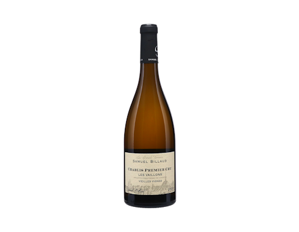

£42
<h3 class="wine-name">Samuel Billaud</h3>

Chablis 1er Cru Vaillons Vieilles Vignes · Chablis 1er Cru · <strong>2021</strong> · Chardonnay

Lay down (grower Chablis)Drink 2026–2031

A clear step up from the village Fèvre: Billaud is one of Chablis&#x27;s finest vignerons, this is premier cru from 60–90-year-old vines, and 2021 made classically taut, mineral Chablis. On offer (down from £49).

<a href="https://www.thewinesociety.com/product/samuel-billaud-chablis-premier-cru-vaillons-vieilles-vignes-2021/" target="_blank" rel="noopener">The Wine Society</a><a href="https://www.wine-searcher.com/find/samuel+billaud+chablis+1er+cru+vaillons+vieilles+vignes/2021" target="_blank" rel="noopener">Wine-Searcher</a><a href="https://www.cellartracker.com/list.asp?szSearch=samuel+billaud+chablis+1er+cru+vaillons+vieilles+vignes+2021" target="_blank" rel="noopener">CellarTracker</a>

### Loire — White

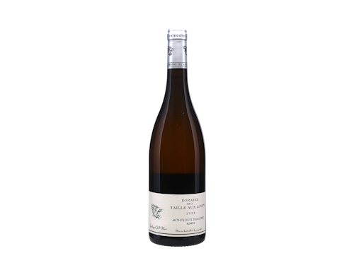

£26
<h3 class="wine-name">Domaine de la Taille aux Loups</h3>

Montlouis &#x27;Rémus&#x27; · Montlouis-sur-Loire · <strong>2022</strong> · Chenin Blanc

Dry Chenin (the gap)Drink 2026–2032

The dry Chenin the cellar lacked. From the late Jacky Blot&#x27;s estate, a giant of Loire Chenin; Rémus is his benchmark cuvée (a former WS Champion). Quince and chalk with real cut; ages a decade.

<a href="https://www.thewinesociety.com/product/montlouis-sur-loire-remus-domaine-de-la-taille-aux-loups-2022-organic/" target="_blank" rel="noopener">The Wine Society</a><a href="https://www.wine-searcher.com/find/domaine+de+la+taille+aux+loups+montlouis+remus/2022" target="_blank" rel="noopener">Wine-Searcher</a><a href="https://www.cellartracker.com/list.asp?szSearch=domaine+de+la+taille+aux+loups+montlouis+remus+2022" target="_blank" rel="noopener">CellarTracker</a>

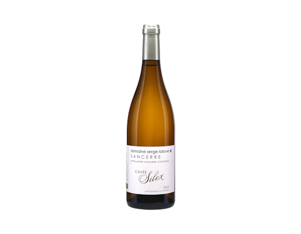
label shown: 2023 vintage

£26
<h3 class="wine-name">Domaine Serge Laloue</h3>

Sancerre Cuvée Silex · Sancerre · <strong>2024</strong> · Sauvignon Blanc

Classic Loire SauvignonDrink 2026–2027

Classic flinty Loire Sauvignon — &#x27;silex&#x27; is the flint soil behind the smoky, gun-flint mineral edge. Laloue&#x27;s top unoaked cuvée; drink young and fresh.

<a href="https://www.thewinesociety.com/product/sancerre-cuvee-silex-domaine-serge-laloue-2023-en.aspx" target="_blank" rel="noopener">The Wine Society</a><a href="https://www.wine-searcher.com/find/domaine+serge+laloue+sancerre+cuvee+silex/2024" target="_blank" rel="noopener">Wine-Searcher</a><a href="https://www.cellartracker.com/list.asp?szSearch=domaine+serge+laloue+sancerre+cuvee+silex+2024" target="_blank" rel="noopener">CellarTracker</a>

### Alsace — White

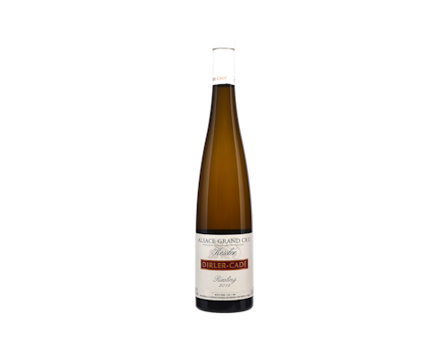

£34
<h3 class="wine-name">Domaine Dirler-Cadé</h3>

Riesling Grand Cru Kessler · Alsace Grand Cru (Kessler) · <strong>2018</strong> · Riesling

Dry Alsace RieslingDrink 2026–2032

Dry Alsace Riesling and a foil to the Mosel — fuller, drier, just as mineral. Small biodynamic family estate; top grand cru site; ripe 2018. Ages well. (Schoenenbourg, Dopff au Moulin 2018 at £26 a value alt.)

<a href="https://www.thewinesociety.com/product/riesling-grand-cru-kessler-domaine-dirler-cade-2018-en.aspx" target="_blank" rel="noopener">The Wine Society</a><a href="https://www.wine-searcher.com/find/domaine+dirler+cade+riesling+grand+cru+kessler/2018" target="_blank" rel="noopener">Wine-Searcher</a><a href="https://www.cellartracker.com/list.asp?szSearch=domaine+dirler+cade+riesling+grand+cru+kessler+2018" target="_blank" rel="noopener">CellarTracker</a>

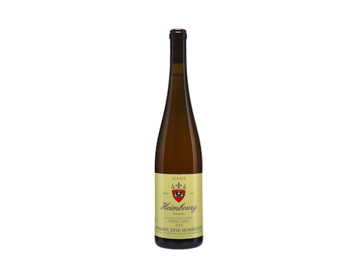

£25
<h3 class="wine-name">Domaine Zind-Humbrecht</h3>

Pinot Gris Heimbourg · Alsace · <strong>2018</strong> · Pinot Gris

Star-grower valueDrink 2026–2028

A star grower (Olivier Humbrecht MW) at a keen price; rich, gingery, white-pepper spice. May carry a touch of residual sweetness, as ZH Pinot Gris often does. Adds aromatic range.

<a href="https://www.thewinesociety.com/product/pinot-gris-heimbourg-domaine-zind-humbrecht-2018-en.aspx" target="_blank" rel="noopener">The Wine Society</a><a href="https://www.wine-searcher.com/find/domaine+zind+humbrecht+pinot+gris+heimbourg/2018" target="_blank" rel="noopener">Wine-Searcher</a><a href="https://www.cellartracker.com/list.asp?szSearch=domaine+zind+humbrecht+pinot+gris+heimbourg+2018" target="_blank" rel="noopener">CellarTracker</a>

### Jura — White

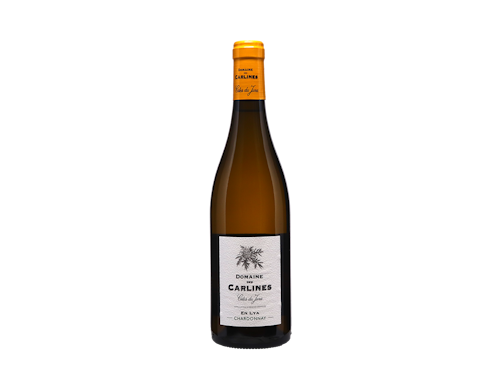

£26.50
<h3 class="wine-name">Domaine des Carlines</h3>

Chardonnay &#x27;En Lya&#x27; · Côtes du Jura · <strong>2019</strong> · Chardonnay

Jura Chardonnay (accessible)Drink 2026–2027

The fresh, food-friendly face of the Jura — full-bodied but mineral Chardonnay from a plot near Château-Chalon; the page&#x27;s best-reviewed Jura. An easy way in.

<a href="https://www.thewinesociety.com/product/chardonnay-en-lya-domaine-des-carlines-2919/" target="_blank" rel="noopener">The Wine Society</a><a href="https://www.wine-searcher.com/find/domaine+des+carlines+chardonnay+en+lya/2019" target="_blank" rel="noopener">Wine-Searcher</a><a href="https://www.cellartracker.com/list.asp?szSearch=domaine+des+carlines+chardonnay+en+lya+2019" target="_blank" rel="noopener">CellarTracker</a>

2022Savagninno photo

£30
<h3 class="wine-name">Domaine des Carlines</h3>

En Charnay Savagnin · Côtes du Jura · <strong>2022</strong> · Savagnin

Jura signature grapeDrink 2026–2031

The Jura&#x27;s signature grape, tasting like nothing else — saline, nutty, faintly wild even in this fresher style. Distinctive but approachable; develops for years. (Vin Jaune 2017 at £44 is the iconic deep end.)

<a href="https://www.thewinesociety.com/product/en-charnay-savagnin-domaine-des-carlines-2022-en.aspx" target="_blank" rel="noopener">The Wine Society</a><a href="https://www.wine-searcher.com/find/domaine+des+carlines+en+charnay+savagnin/2022" target="_blank" rel="noopener">Wine-Searcher</a><a href="https://www.cellartracker.com/list.asp?szSearch=domaine+des+carlines+en+charnay+savagnin+2022" target="_blank" rel="noopener">CellarTracker</a>

### Provence — Rosé

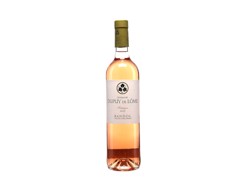

£19.50
<h3 class="wine-name">Dupuy de Lôme</h3>

Bandol Rosé · Bandol · <strong>2025</strong> · Mourvèdre blend

Serious / ageworthyDrink 2026–2028

Bandol is the gastronomic, Mourvèdre-led side of Provençal rosé — fuller, structured and built for the table rather than the sun-lounger; holds a couple of years. The serious pink, keenly priced for the appellation.

<a href="https://www.thewinesociety.com/product/bandol-rose-dupuy-de-lome-2025-en.aspx" target="_blank" rel="noopener">The Wine Society</a><a href="https://www.wine-searcher.com/find/dupuy+de+lome+bandol+rose/2025" target="_blank" rel="noopener">Wine-Searcher</a><a href="https://www.cellartracker.com/list.asp?szSearch=dupuy+de+lome+bandol+rose+2025" target="_blank" rel="noopener">CellarTracker</a>

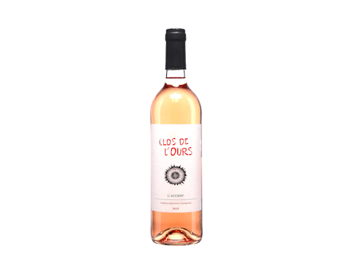

£16.50
<h3 class="wine-name">Clos de l&#x27;Ours</h3>

Côtes de Provence Rosé &#x27;L&#x27;Accent&#x27; · Côtes de Provence · <strong>2025</strong> · Cinsault

Quality grower / easyDrink 2026–2027

The easy-drinking counterpoint, but from a quality organic grower rather than a faceless brand — fuller and more savoury than the supermarket style, with redcurrant fruit and Mediterranean-herb lift. The summer/BBQ bottle.

<a href="https://www.thewinesociety.com/product/cotes-de-provence-rose-clos-de-lours-laccent-2025-en.aspx" target="_blank" rel="noopener">The Wine Society</a><a href="https://www.wine-searcher.com/find/clos+de+l+ours+cotes+provence+rose+accent/2025" target="_blank" rel="noopener">Wine-Searcher</a><a href="https://www.cellartracker.com/list.asp?szSearch=clos+de+l+ours+cotes+provence+rose+accent+2025" target="_blank" rel="noopener">CellarTracker</a>

------------------------------------------------------------------------

*Compiled from a Wine Society shortlist, June 2026. Prices, vintages and availability change — confirm on the merchant page before buying. Bottle images © The Wine Society, shown for identification.*

