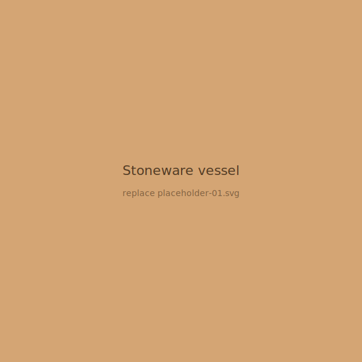
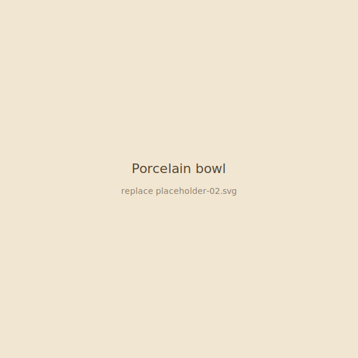
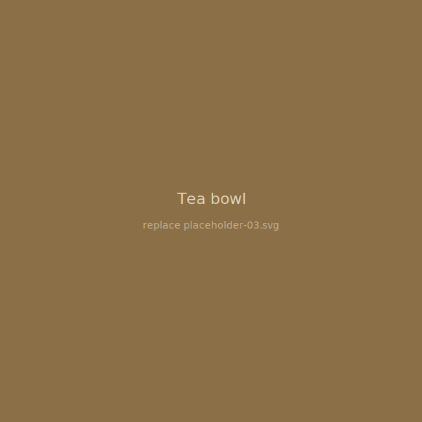
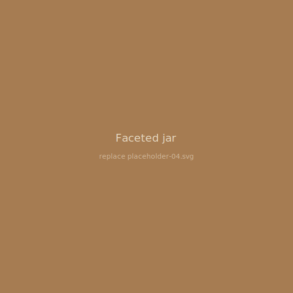
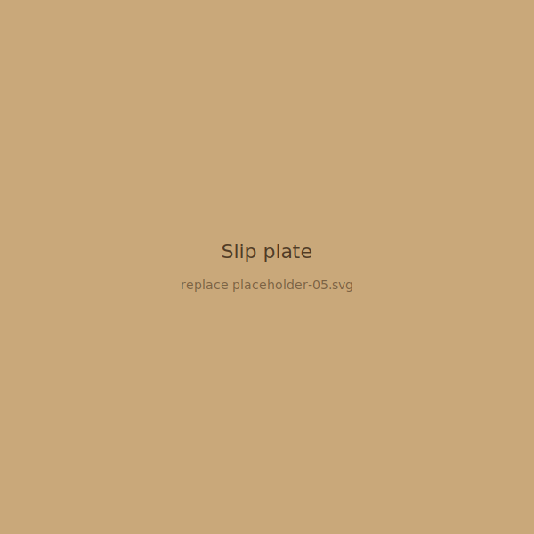
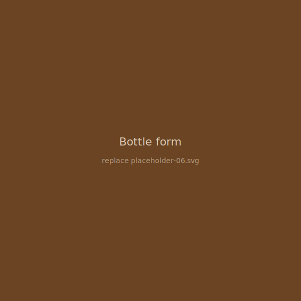
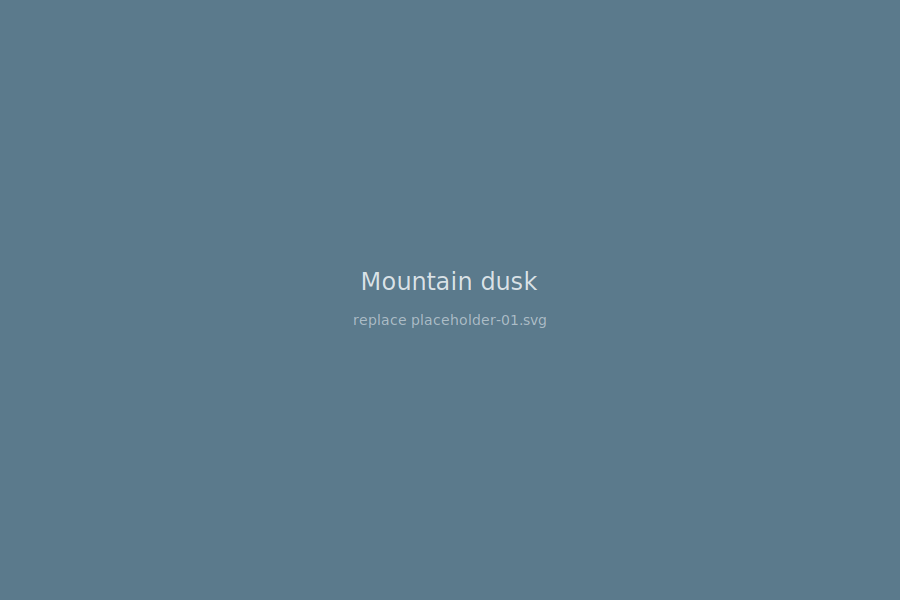
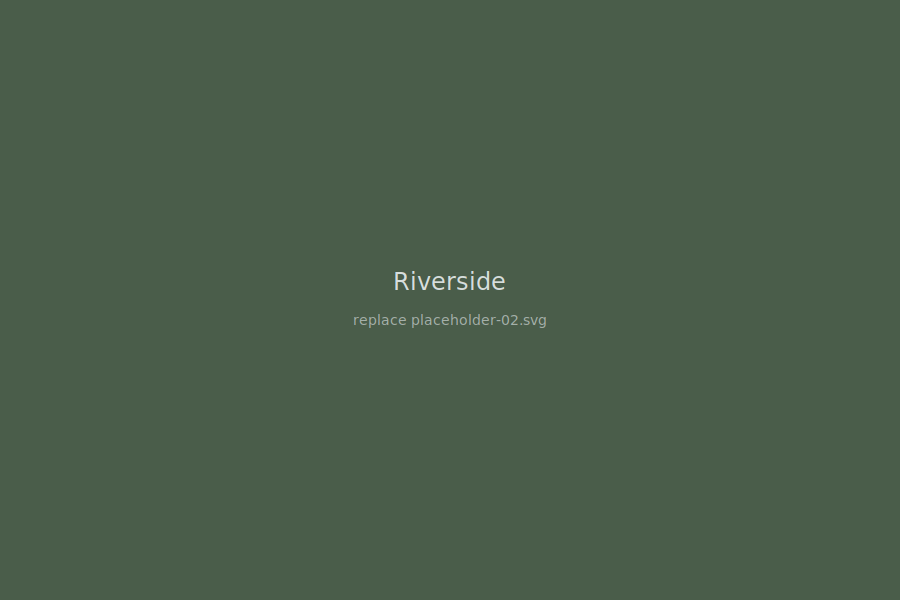
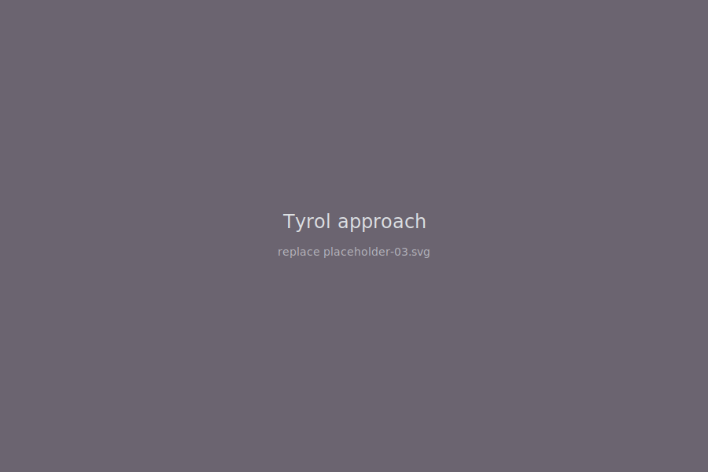
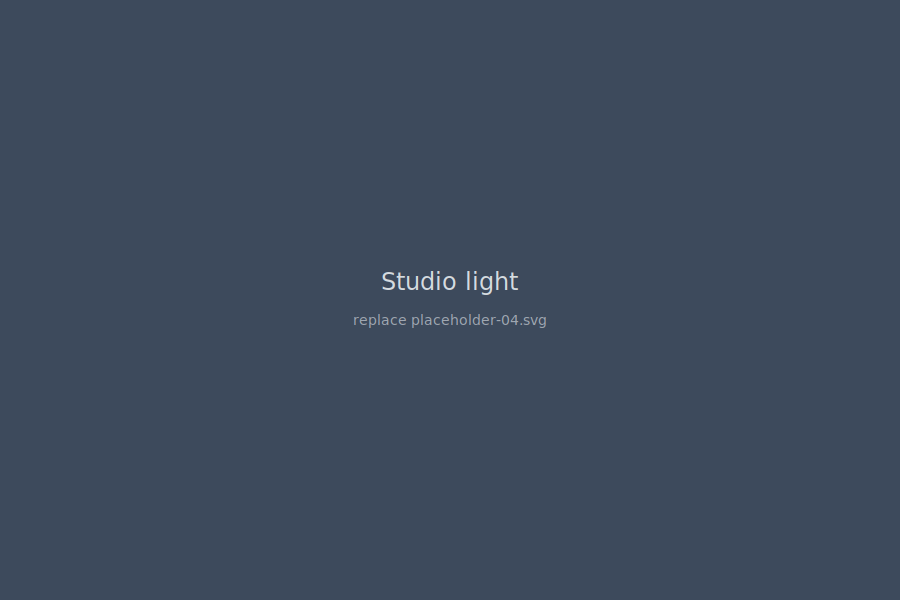

This page is just a placeholder with some dummy text, it's moe about experimenting with Quarto layout than anyting else!

## Ceramics

::: {layout-ncol=3}
{group="ceramics"}

{group="ceramics"}

{group="ceramics"}

{group="ceramics"}

{group="ceramics"}

{group="ceramics"}
:::

## Photography

::: {layout-ncol=2}
{group="photo"}

{group="photo"}

{group="photo"}

{group="photo"}
:::

::: {.callout-note collapse="true"}
## Notes on the work

Both also reward patience in a way the rest of my work doesn't.
:::
